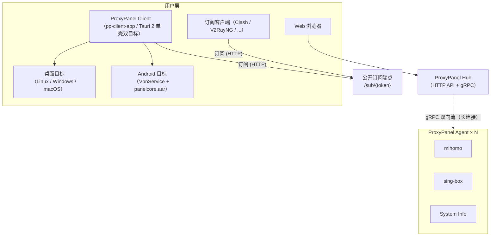
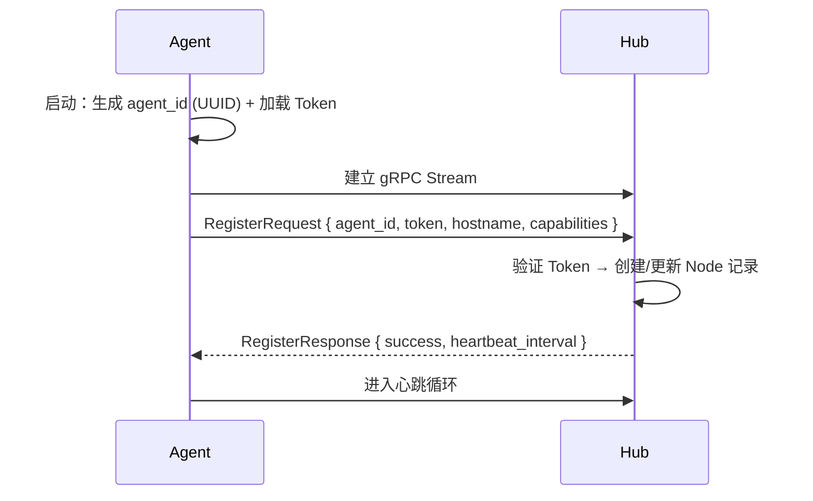
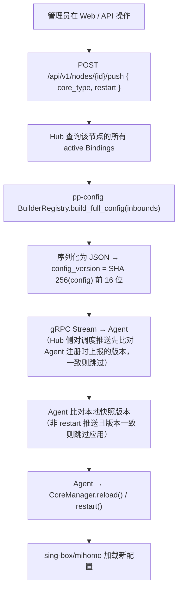
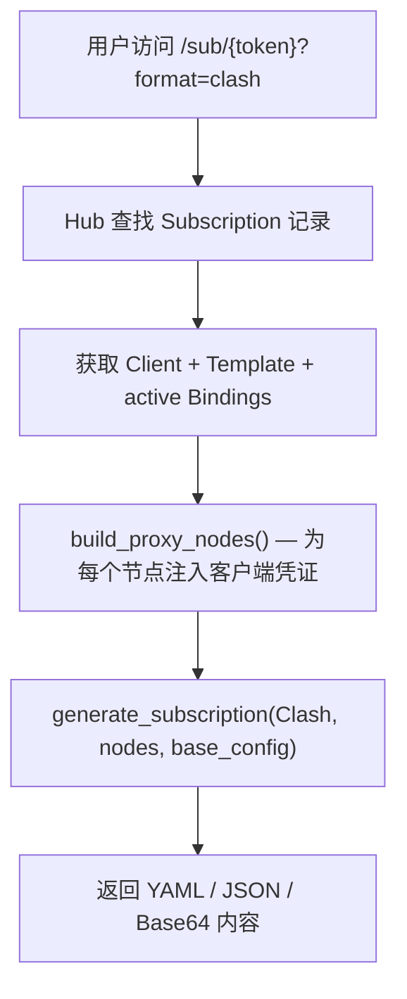
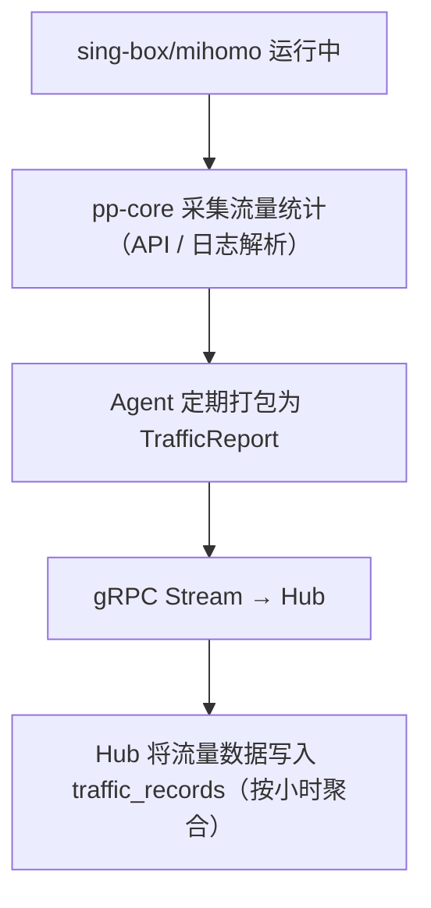
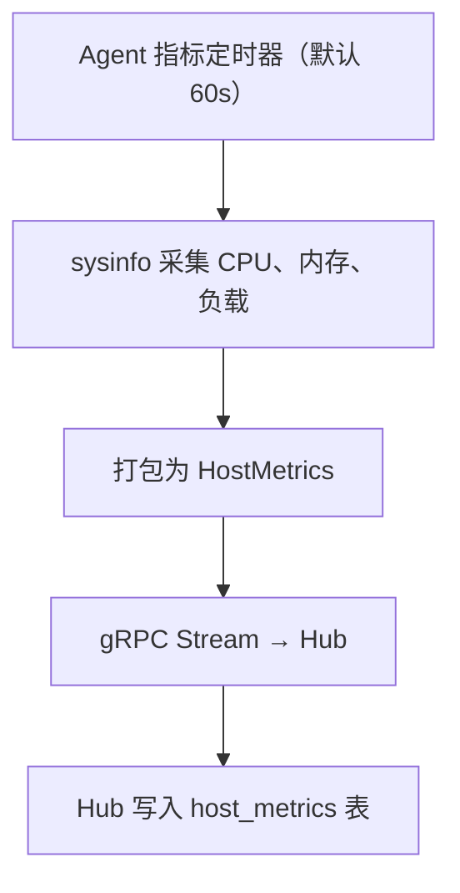
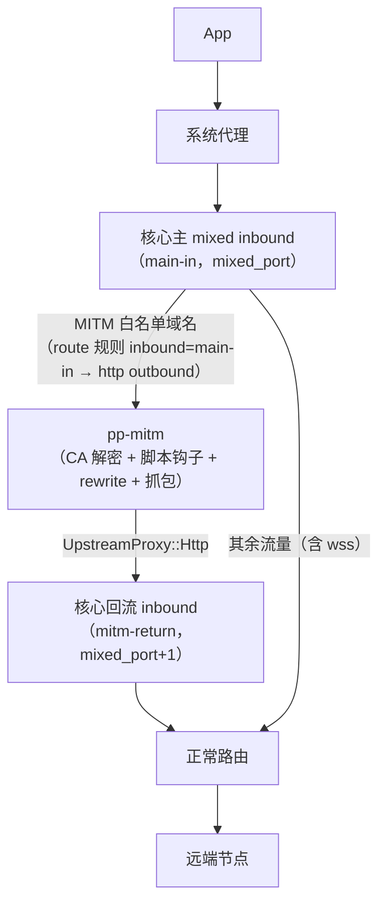
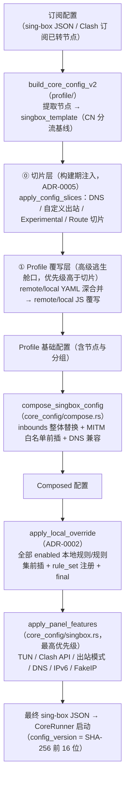
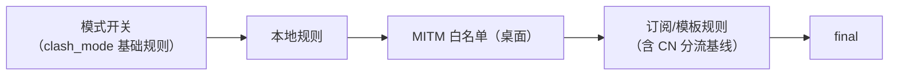
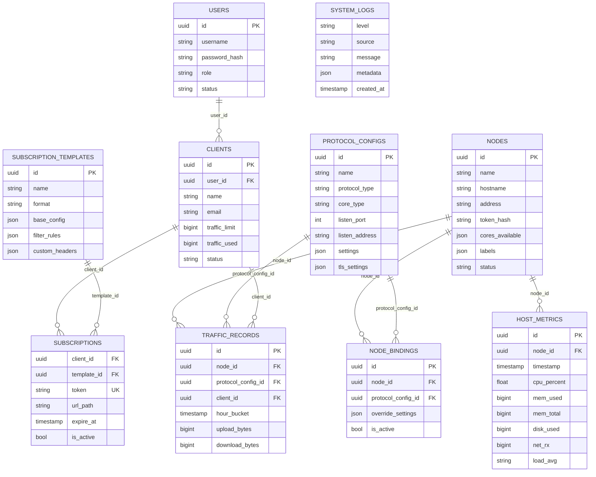

# ProxyPanel 架构文档

本文档描述 ProxyPanel 的整体架构、组件交互、数据流和关键技术决策。

---

## 目录

1. [整体架构](#整体架构)
2. [组件详解](#组件详解)
3. [数据流](#数据流)
4. [客户端架构](#客户端架构)
5. [数据库设计](#数据库设计)
6. [通信协议](#通信协议)
7. [安全模型](#安全模型)
8. [扩展点](#扩展点)
9. [性能考量](#性能考量)

---

## 整体架构

ProxyPanel 采用经典的 **Hub-Agent** 分布式架构，并在此基础上扩展了用户侧客户端（**单一 Tauri 应用 `apps/client`，单壳双目标：桌面 / Android**，见 [客户端架构](#客户端架构)）。系统由四个主要部分组成：用户层（Web 管理界面、订阅客户端、桌面/移动客户端）、Hub、Agent 与 ProxyPanel Client。



桌面与 Android 目标（详见 [客户端架构](#客户端架构)）经由 `Hub /sub/{token}` 订阅端点拉取节点配置，在本地驱动代理核心：桌面目标叠加 MITM 与脚本引擎，代理流量直连远端节点；Android 目标由内置 Go 引擎（`panel-core` → `panelcore.aar`）驱动核心并以 VPN 模式接管流量。

> **注：MITM 为桌面目标能力（Android 受系统限制不支持，`apps/client/src-tauri` 的 Android target 依赖表天然不含 `pp-mitm`）。**

### 设计原则

- **无状态 Hub**: Hub 不保存运行时状态（除 Agent 连接句柄外），所有持久化数据存入数据库
- **自治 Agent**: Agent 在断连后可独立运行，重连后自动同步状态
- **配置即代码**: 协议配置存储为结构化 JSON，通过 Builder 模式转译为特定核心的配置格式
- **插件化协议**: 新增协议只需实现 `ConfigBuilder` trait，无需修改 Hub 核心逻辑

---

## 组件详解

### pp-hub — 中央管理面板

Hub 是系统的控制平面，提供三种服务：

| 服务 | 协议 | 端口 | 说明 |
|------|------|------|------|
| REST API | HTTP/1.1 | 8081 (默认) | 管理操作、查询接口 |
| gRPC | HTTP/2 | 50052 (默认) | Agent 长连接、双向流通信 |
| Web App | HTTP/1.1 | 8081 (同 API) | 静态文件服务，SPA 回退 |

**内部模块：**

```
pp-hub/
├── src/
│   ├── main.rs              # 入口：启动 HTTP + gRPC 双服务
│   ├── state.rs             # AppState：共享状态（DB + Agent 连接表）
│   ├── grpc/
│   │   └── agent_service.rs # HubAgent gRPC 服务实现
│   ├── middleware/
│   │   └── auth.rs          # JWT / Token 认证中间件（预留）
│   ├── routes/              # HTTP 路由处理器
│   │   ├── nodes.rs         # 节点 CRUD + 配置推送
│   │   ├── protocol.rs      # 协议配置 CRUD + REALITY 密钥生成
│   │   ├── client.rs        # 客户端（用户）管理
│   │   ├── bindings.rs      # 节点-配置绑定
│   │   ├── subscription.rs  # 订阅模板 + 订阅管理 + 公开订阅端点
│   │   ├── traffic.rs       # 流量查询
│   │   ├── metrics.rs       # 主机指标查询
│   │   ├── logs.rs          # 系统日志查询
│   │   └── health.rs        # 健康检查
│   └── service/             # 业务逻辑层
│       ├── node.rs          # 节点业务逻辑
│       ├── protocol.rs      # 配置生成服务
│       ├── subscription.rs  # 订阅业务逻辑
│       └── traffic.rs       # 流量统计服务
```

### pp-agent — 节点代理

Agent 部署在每个代理节点上，负责：

1. **gRPC 连接管理**: 与 Hub 建立双向流，自动重连
2. **核心进程管理**: 发现、启动、停止、重载 sing-box/mihomo
3. **指标上报**: 定时采集并上报主机 CPU、内存、网络、负载
4. **流量上报**: 从核心进程获取并上报流量统计
5. **日志上报**: 收集核心日志并批量上报

**内部模块：**

```
pp-agent/
├── src/
│   ├── main.rs              # 入口：参数解析、Token 加载、启动客户端
│   └── client.rs            # AgentStreamClient：gRPC 连接、重连、消息处理
```

### pp-web — Web 前端

基于 React 的响应式单页应用（SPA）：

- **技术栈**: React 19 + TypeScript + Vite 8 + HeroUI 3 + Tailwind CSS v4 + react-i18next（国际化）
- **构建目标**: 静态 JavaScript / CSS 资源（由 Hub 或 CDN 托管）
- **通信方式**: 通过 Axios 调用 Hub REST API

**页面结构：**

| 路由 | 页面 | 功能 |
|------|------|------|
| `/` | Dashboard | 全局概览、统计卡片、节点状态、最近日志 |
| `/nodes` | Nodes | 节点列表、创建、删除、状态监控、父节点配置 |
| `/protocols` | Protocols | 协议配置管理、REALITY 密钥生成 |
| `/bindings` | Bindings | 节点与协议配置的绑定关系 |
| `/clients` | Clients | 客户端（用户）管理、流量配额、on-hold 状态 |
| `/groups` | Groups | 用户组管理 |
| `/subscriptions` | Subscriptions | 订阅模板与订阅链接管理 |
| `/hosts` | Hosts | 主机设置与变量管理 |
| `/metrics` | Metrics | 主机性能指标图表 |
| `/traffic` | Traffic | 实时与历史流量查询 |
| `/onlines` | Onlines | 在线用户列表 |
| `/logs` | Logs | 系统日志查看与筛选 |
| `/api-keys` | ApiKeys | Bootstrap 与管理 API Key |
| `/webhooks` | Webhooks | Webhook 事件接收配置 |

### pp-core — 核心进程管理

提供 sing-box 和 mihomo 的统一管理抽象：

```rust
/// 核心管理器接口
trait CoreManager: Send + Sync {
    fn core_type(&self) -> CoreType;
    async fn start(&self, config: &Value) -> PanelResult<()>;
    async fn stop(&self) -> PanelResult<()>;
    async fn restart(&self, config: &Value) -> PanelResult<()>;
    async fn reload(&self, config: &Value) -> PanelResult<()>;
}

/// 节点上的核心监管器
struct CoreSupervisor {
    managers: RwLock<HashMap<CoreType, Arc<dyn CoreManager>>>,
}
```

**功能：**
- 自动发现系统中的 sing-box/mihomo 二进制文件（缺失时按需从 GitHub Releases 下载安装）
- 通过子进程管理核心生命周期
- 配置文件变更监听（`notify` crate）
- 流量统计采集（通过核心提供的 API / 日志解析）

### pp-config — 配置构建器

将数据库中存储的通用协议配置转译为 sing-box 可识别的 JSON 配置（mihomo 配置同样以 JSON 形式在 Hub↔Agent 间传输，由 Agent 侧的 `MihomoProcessManager` 在落盘时序列化为 `mihomo.yaml`）。

**架构：**

```rust
trait ConfigBuilder: Send + Sync {
    fn core_type(&self) -> CoreType;
    fn build_inbound(&self, protocol: ProtocolType, settings: &Value, tls: Option<&Value>) -> PanelResult<Value>;
    fn build_full_config(&self, inbounds: &[InboundConfig]) -> PanelResult<Value>;
}
```

**实现：**
- `SingBoxConfigBuilder`: 生成 sing-box 配置
- `MihomoConfigBuilder`: 生成 mihomo 配置（listeners 结构；vless 用户为列表、hysteria2/anytls 用户为映射；TLS 支持托管证书（agent 内置 ACME 统一目录）或显式证书文件；内置 ACME 为 sing-box 专属）

**BuilderRegistry**: 运行时注册表，支持按核心类型查找对应的构建器。

### pp-subscription — 订阅生成器

将标准化的代理节点列表序列化为各种客户端支持的订阅格式。

**支持的格式：**

| 格式 | 内容类型 | 典型客户端 |
|------|----------|-----------|
| Base64 | `text/plain` | V2RayN、V2RayNG、Shadowrocket |
| JSON | `application/json` | 通用 |
| Clash | `application/x-yaml` | Clash Verge、Clash Meta |
| SingBox | `application/json` | sing-box GUI、NekoBox |
| V2RayNG | `application/json` | V2RayNG (专用格式) |

**凭证注入：**

订阅生成时会自动将客户端的 UUID/Email/Password 注入到节点配置中，实现"一链一用户"。

### pp-db — 数据库层

基于 Sea-ORM 的数据库抽象层：

- **连接管理**: 支持 PostgreSQL 和 SQLite
- **迁移系统**: 使用 `sea-orm-migration`，版本化 schema 变更
- **实体定义**: 手写实体匹配迁移 schema（生产环境建议使用 `sea-orm-cli generate entity`）

### pp-common — 共享基础设施

所有 crate 共享的基础模块：

- `models.rs`: DTO（NodeDto、ProtocolConfigDto、ClientDto）
- `protocol.rs`: 枚举（ProtocolType、CoreType、NodeStatus、UserStatus）
- `crypto.rs`: 加密工具（Token 生成、UUID、X25519 密钥对）
- `error.rs`: 全局错误类型 `PanelError` / `PanelResult<T>`

### pp-proto — gRPC 协议

由 `tonic-build` 从 `proto/hub_agent.proto` 自动生成的 Rust 代码。

---

## 数据流

### 3.1 节点注册流程



### 3.2 配置推送流程



### 3.3 订阅服务流程



### 3.4 流量上报流程



### 3.5 主机指标上报流程



---

## 客户端架构

客户端自 ADR-0007 起是**单一 Tauri 应用** `apps/client`（单包双入口、单壳双目标），平台差异全部为**编译期事实**；前端共享库与 Rust 共享命令层各自单份实现（ADR-0003 的分离收益由编译期机制保留）。

**桌面目标**（`apps/client/src/pages` 的桌面呈现 + 壳的 `desktop/` 适配层）运行于 Linux/Windows/macOS：经由 Hub 的公开订阅端点拉取节点配置，在本地驱动 sing-box 核心（桌面端已移除 mihomo 支持；Clash 格式订阅在拉取时经 `node_convert` 转换为 sing-box 节点运行），并叠加 MITM 与脚本引擎实现 HTTPS 解密抓包、请求响应重写、QX/Surge/Loon 脚本兼容与本地定时任务。

**Android 目标**（`apps/client/src/pages` 的移动呈现 + 壳的 `mobile/` 适配层）面向 Android：核心由内置 Go 引擎（`panel-core`，gomobile 合并 libbox/mihomo 为单一 `panelcore.aar`）提供，经 Kotlin 桥驱动并以 VPN 模式接管流量；无 MITM（`apps/client/src-tauri` 的 target 依赖表使 Android 构建图不含 `pp-mitm`）。

| 载体 | 类型 | 职责 |
|------|------|------|
| `apps/client/src/pages` | 双端单一页面目录 | Config / DNS / 出站 / 路由 / 规则 / 规则集 / Experimental 共用实现；少量历史平台能力/交互差异仍在页内分支 |
| `apps/client/src/routes.tsx` / `App.tsx` | 单一路由表与入口 | sharedRoutes + `IS_MOBILE` 平台路由；订阅规范路径 `/subscriptions`，`/nodes` 与旧规则路径保留重定向；`@app` alias 已移除 |
| `apps/client/src-tauri`（`pp-client-app`） | 单壳（独立 cargo 项目） | `lib.rs` 单份装配（共享命令全路径注册，平台专属命令 cfg 逐条门控）；`desktop/` 适配层（mitm / core_mgmt / remote / platform 命令 + WSL workaround），`mobile/` 适配层（Android 数据目录 + VPN 插件注册）；target 依赖表裁剪 Android 构建图 |
| `packages/client-core`（`@pp/client-core`） | 前端共享库 | api（Tauri invoke 封装 + 类型 + query keys）/ hooks / atoms / 纯工具；两端 UI 禁止直接 `invoke()` |
| `packages/ui`（`@pp/ui`） | 自研前端组件库（ADR-0013） | Base UI 行为层 + Tailwind v4 语义令牌（`tokens.css`），`IS_MOBILE` 编译期分发桌面/移动呈现；客户端已移除 HeroUI/Konsta；仪表盘数据与启停回写共用 `client-core/useDashboardState` |
| `pp-client-tauri` | Rust 共享命令层 | state / logs / capabilities / 通用命令单份实现；Android 专属 `core_bridge`（`cfg(target_os = "android")`）也在此 crate |
| `pp-script` | 脚本引擎层 | QuickJS 运行时 + QX/Surge/Loon 三方言 API 适配 + cron 调度 |
| `pp-mitm` | HTTPS MITM 引擎 | CA 管理、hudsucker 封装、重写 / 脚本钩子 / 抓包、上游代理（桌面目标专属，Android 构建图不含） |
| `pp-client` | 客户端核心库 / 引擎层 | 订阅同步、核心配置合成、系统代理、生命周期编排；`CoreEngineBridge` 抽象——桌面 spawn sing-box 子进程 / Android 经 Kotlin 桥驱动 Go 引擎 |

客户端布局由 `@pp/ui` 的 Shell 分发（桌面 Sidebar、移动 TabBar），Modal / SelectField / DataList 分别分发弹窗与抽屉、下拉与 sheet-picker、表格与卡片。移动主题属性挂在 `<html data-ui-style>`，确保 portal 弹层继承 iOS/Material 令牌。双端 ToastRegion 统一消费 client-core 静态队列，不调用 view-transition。

> `capabilities::get_capabilities` 的 `is_android` 保留为**运行时功能开关**（桌面目标上 mitm 等仍可能因环境禁用）；UI 平台差异是编译期事实，desktop UI 已不再消费该字段。Tauri 配置为桌面基线 `tauri.conf.json` + Android overlay `tauri.android.conf.json`（RFC 7396 合并：devUrl / 构建命令 / bundle 差异）。

### pp-script — 脚本引擎层

基于 QuickJS（`rquickjs` 0.12）的客户端代理脚本引擎：

- **引擎无关抽象**: [`ScriptEngine`] trait 定义引擎边界，为未来第二个后端（Apple JavaScriptCore，feature-gated `engine-jsc`）预留；当前后端实现见 `engine_quickjs.rs`
- **三方言 API 适配**（`dialect.rs`）: 同一 host 能力按方言注入不同全局名——QX（`$task` / `$prefs` / `$notify`）、Surge（`$httpClient` / `$persistentStore` / `$notification`）、Loon（以上全部 + `$loon` 标记，超集），统一包含 `$done` 与 `setTimeout` 注册表实现
- **`ScriptWorker` actor**（`worker.rs`）: rquickjs 的 `AsyncRuntime` 内部含非 `Send` 结构，统一收敛为「专有 OS 线程 + 专用 `current_thread` tokio runtime」，任务经 mpsc 通道串行化执行，对外暴露 `Send` future
- **`ScriptScheduler`**（`scheduler.rs`）: cron / event 脚本调度（QX/Surge/Loon 的 task/cron 签到类脚本），支持注册 / 移除、手动触发、到期批量执行；cron 表达式为 **6 段含秒**，**5 段自动补 0**
- **`FilePersistentStore`**（`host.rs`）: 每个 scope 一个 JSON 文件，文件名 = scope **SHA-256 前 16 位 hex** + `.json`，write / erase 同步**原子落盘**（tempfile + rename），重启不丢

### pp-mitm — HTTPS MITM 引擎

本地 HTTPS 中间人代理，基于 hudsucker 0.25：

> **注：MITM 为桌面目标能力（Android 不提供，`apps/client/src-tauri` 的 Android target 依赖表不含本 crate）。**

- **CA 管理**: [`CaStore`] trait 抽象 CA 材料，[`FileCaStore`] 为基于本地目录的默认实现，首次调用用 **rcgen** 生成自签证书（`ca.crt` / `ca.key`，文件权限 **0600**）
- **hudsucker 封装**: 白名单双钩子 passthrough——`should_intercept_connect`（CONNECT 按主机名白名单判定是否拦截）+ `should_intercept_tls`（TLS ClientHello 按 SNI 二次判定），白名单外流量整体盲隧道透传；库层空白名单语义为「全拦截」，但产品层（pp-client）在空白名单时不启动 MITM 链（见下）
- **CA 系统信任**（`ca_trust.rs`）: 一键将 CA 安装到系统信任库 + 信任状态检测——Windows `certutil -user -addstore Root`（CurrentUser 存储，免 UAC）/ macOS `security add-trusted-cert`（osascript 提权）/ Linux `pkexec install + update-ca-certificates`；检测按平台分别走 certutil 输出匹配、`security verify-cert` 退出码、anchors 目录 SHA-256 指纹比对
- **`RewriteEngine`**（`rewrite.rs`）: URL / Header / Body / Reject / Mock 五类重写动作
- **`ScriptHookEngine`**（`script_hook.rs`）: 将 http-request / http-response 类型脚本按 URL 规则挂载到流量路径，成功时回写输出，脚本**超时或抛异常时 no-op（透传原值）**并记录警告
- **流量抓包**: [`TrafficRecorder`] trait + [`MemoryRecorder`] 环形缓冲实现（`recorder.rs`）
- **上游代理链**（`upstream.rs`）: [`UpstreamProxy`]（Direct / HTTP CONNECT 父代理 / SOCKS5 父代理），经实现 [`tower::Service<Uri>`] 的自定义 connector 接入 hudsucker 的 `with_http_connector` 扩展点

### pp-client — 客户端核心库（引擎层）

承载客户端核心业务逻辑，经共享命令层供单壳的桌面 / Android 目标调用（桌面为全功能形态；Android 以不含 MITM 的部分复用）：

- **配置**: `ClientConfig`（`client.json`）定义客户端配置，含 `mixed_port`（默认 17890）与 MITM 配置
- **订阅同步**（`subscription.rs`）: 拉取 `?format=singbox` / `?format=clash` 订阅（Clash 节点经 `node_convert::mihomo_to_singbox` 转换为 sing-box 节点），解析 `subscription-userinfo` 响应头（upload / download / total / expire）
- **核心配置合成**（`core_config.rs`）: 将订阅配置合成为本地 sing-box 启动配置，构建 **MITM 链路**——双 mixed inbound（主入口 `main-in` + 回流入口 `mitm-return`），route 规则前插 `inbound = [main-in]` 白名单规则；**空白名单（含仅排除项）时不启动 MITM 链、不注入路由与 `pp-mitm` outbound**，避免无域名条件的 match-all 规则把全部流量送进 MITM
- **MITM 编排**（`mitm.rs`）: MITM 上游指向本机核心回流 mixed 入站端口（默认 `mixed_port + 1`），解密后的流量回流核心继续正常路由
- **核心进程**（`runner.rs`）: `CoreRunner` 封装 pp-core 的 `CoreManagerFactory`，管理 sing-box 子进程；生命周期为 ADR-0012 纵深防御——OS 级父子绑定（Windows Job Object / Linux `PR_SET_PDEATHSIG`）、PID 文件 + 启动收割、退出事件清理、端口占用前置诊断（`port_guard.rs`，报错指明占用者进程名与 PID）
- **系统代理**（`sysproxy.rs`）: `SystemProxy` trait + 平台实现——macOS `networksetup`、Windows `reg add`（Internet Settings）、Linux `gsettings`（GNOME），命令构造为纯函数便于单测断言，可注入 `MockSystemProxy`
- **远程订阅**（`remote.rs`）: `RemoteManager` 定时拉取远程脚本 / 重写片段，写本地缓存（`data_dir/remote_cache/<name>.json`），运行期 `load_cached` 合并
- **导入**（`import.rs`）: 把 QX / Surge / Loon 的 rewrite / script / task / mitm 片段经 `parse_import` 解析为 pp-mitm 规则与 pp-script 任务，未知行跳过并记 warning
- **生命周期编排**（`state.rs`）: `ClientState` 编排启动链（订阅 → MITM → 合成配置 → 核心 → 系统代理），任一步失败**逆序回滚**，notifier / sysproxy 可注入
- **连接追踪**（`connections/`）: Clash API `/connections` 采集器——**WebSocket 推送优先**（`?interval=1000` 全量快照推送，瞬时失败按退避重连，仅当服务端拒绝 upgrade 时永久回退 2s HTTP 轮询），快照差分维护活跃/已关闭连接视图（环形缓冲 500 条）
- **流量统计**（`stats/`）: 客户端本地 SQLite（`<data_dir>/stats.db`，sqlx 直连 + `PRAGMA user_version` 轻量版本管理，不依赖 pp-db/sea-orm）。tracker 每轮快照差分产出字节增量（`StatDelta`）增量 upsert 日聚合表 `daily_stats`（`date + target(域名/IP) + destination_ip + rule + rule_payload + outbound` 六元主键），长连接流量随快照渐进入账；关闭连接写入明细表 `conn_records`（保留 7 天，聚合保留 90 天，打开时清理）。防重复计数：仅 `start ≥ tracker 启动时间` 的连接全量入账并计 conn_count，早前存活连接只建基线

### apps/client — 客户端（单壳双目标，UI + 壳）

由 ADR-0003 的 desktop / mobile 双应用合并而来（ADR-0007 回摆为单应用）：

- **桌面目标**: Tauri 2（独立 cargo 项目 `apps/client/src-tauri`，包名 `pp-client-app`，**退出根 workspace**）+ 桌面呈现（React 19 / Vite 8 / Tailwind CSS 4 / `@pp/ui`），Bun 作为包管理器；页面为仪表盘（`/`）、订阅（`/subscriptions`，`/nodes` 重定向）、MITM（`/mitm`）、脚本（`/scripts`）、设置（`/settings`），以及代理、连接、统计、覆写、日志与配置子页
- **通知**: `tauri-plugin-notification` 桌面通知
- **壳**: 注册共享层命令（`pp-client-tauri`）+ 平台专属命令——桌面：mitm / core_mgmt / remote / tun 授权 / gpu_acceleration 等，含 WSL WebKitGTK workaround；Android：`core_bridge` 三命令与 vpn 插件注册
- **数据目录**: 桌面解析为桌面语义（`~/.proxy-panel-client`）；Android 使用应用私有目录（`app_data_dir()`，HOME 在 Android 为只读 `/`）

### Android 目标（同一 `apps/client` 的移动目标）

- **技术栈**: 同一壳的移动目标（`tauri.android.conf.json` overlay）+ 移动 UI（React 19 / Tailwind CSS 4 / **@pp/ui**，iOS/Material 双主题可在设置中切换，默认 iOS），Bun 作为包管理器
- **核心引擎**: 内置 Go 模块 `panel-core`（`apps/client/panel-core`）经 gomobile 产出 `panelcore.aar`，由 Kotlin `VpnPlugin` / `ProxyVpnService` 以 VPN 模式驱动
- **无 MITM**: `apps/client/src-tauri` 的 target 依赖表使 Android 构建图不含 `pp-mitm`（ADR-0003 §3.5 的依赖图隔离思路由 ADR-0007 §2 保留）
- **构建**: 交叉编译与 AAR 打包见 `docs/development.md`「Android 客户端构建」

### pp-client-tauri — 共享命令层（桌面 / Android）

`apps/client` 单壳的桌面 / Android 目标共享的 Tauri 命令实现与辅助（架构分离源自 ADR-0003 §3.2，合并见 ADR-0007）：

- **共享状态**（`state.rs`）: `AppState`（数据目录 + 日志 guard + 懒打开的流量统计存储 `StatsStore`），数据目录由壳层注入（桌面路径 / Android 应用私有目录）
- **日志系统**（`logs/`）: 日志初始化、滚动文件查询/导出/清空、前端日志上报
- **平台能力矩阵**（`capabilities.rs`）: `get_capabilities` / `platform_info`；`is_android` 语义退化为运行时功能开关（desktop UI 已不消费）
- **通用命令**（`commands/`）: config / subscription / profile / proxies / connections / stats（流量统计：stats_today / stats_daily / stats_records / stats_clear）/ preview / task / local_override 等单份实现
- **Android 专属**（`core_bridge.rs`，`cfg(target_os = "android")`）: `request_vpn_permission` / `vpn_last_error` / `notify_prefs_changed` + Kotlin VpnPlugin 桥（`vpn_plugin`）
- 壳层以全路径注册本 crate 命令（Tauri 2 支持跨 crate 注册）

### 客户端流量链路

桌面客户端的流量链路（核心主入口 → MITM → 核心回流）是理解 MITM 挂载方式的关键：



1. App 的请求经系统代理指向核心主 mixed 入站（`main-in`，监听 `mixed_port`）
2. 命中 MITM 白名单的域名：由 route 白名单规则（`inbound = [main-in]`）匹配，经 http outbound 转发到 `pp-mitm`
3. pp-mitm 完成 CA 解密、脚本钩子、重写与抓包后，经 `UpstreamProxy::Http` 转发到核心回流入站（`mitm-return`，监听 `mixed_port + 1`），回到核心后走正常路由链到远端节点
4. 其余流量（含 wss）不经过 MITM，直接正常路由到远端节点

### 配置合成链路

客户端启动时把「订阅节点 + 配置切片 + Profile 覆写」合成为最终 sing-box 启动 JSON 的分层链路（`pp-client`，入口 `state::start`，层序 ⓪→⑤ 与优先级见 ADR-0005 §3.2）：



各阶段职责一句话：

| 阶段 | 职责 |
|------|------|
| `singbox_template` | 生成 sing-box 基础骨架（CN 分流基线，ADR-0005 P4 补记）：`local` DoH / `remote` DoH DNS 与 `clash_mode`/`geosite-cn` DNS 规则、private/CN→`direct` 与 `geolocation-!cn`→主 selector 路由规则、5 个 MetaCubeX 远程规则集（统一经顶层 `http_clients.rule-set-direct` 直连下载，解析走直连 `local` DNS，不经代理），`proxy`（主 selector 组）/`auto`（urltest，含 `tolerance=150`）/`direct`/`block` 分组 |
| `apply_config_slices` | ⓪ 切片层（ADR-0005）：读取 `config_slices.json`，按**内容驱动**注入（无切片级总开关，见 P4 补记）——把 DNS 切片、自定义出站切片、Experimental 与 Route 切片注入模板，自定义出站 tag 强制 `slice-` 前缀；出站含协议节点与 selector/urltest 分组（v1 禁嵌套分组）；Experimental 深合并写入 `experimental.cache_file`（保留 `clash_api` 等同级键）。DNS 切片 schema 支持 `clash_mode` 匹配类型与 `reverse_mapping` 字段，内置默认 DNS 经 `builtin_dns_slice_get`（真值源 `core_config::baseline::builtin_dns_slice`）映射进前端可视化编辑器，编辑即接管（2026-09 补记） |
| Profile 覆写（YAML/JS） | 模板与切片之上叠加用户 Profile（远端为底、本地覆盖），改写节点分组、路由与实验字段，可显式接管模式语义；优先级高于切片层 |
| `compose_singbox_config` | 注入本地可用的 inbounds（mixed 主入口；桌面 MITM 双入站）与 MITM 白名单规则、DNS 兼容适配 |
| `apply_local_override` | 前插**全部 enabled** 本地规则/规则集并处理 final（场景模板已移除，不再按模板引用过滤；本地规则优先于订阅规则）；规则集注入扫描的引用来源含规则卡与已渲染 DNS 规则的 `rule_set`（ADR-0005 P2 补记） |
| `ruleset_manager` | 内置 CN 规则集本地化管理（ADR-0005 启动风险补记）：启动前按镜像回退（jsDelivr → GitHub raw → GitHub 代理前缀）下载到 `data_dir/rulesets/builtin/`，合成配置改写为 `type: local`；下载失败的 tag 连同引用规则降级移除（核心永远可启动），缺失 tag 暴露 `ClientStatus.missing_rule_sets`，命令层后台重试补齐后自动重载核心 |
| `apply_panel_features` | 最后强制注入设置页配置（TUN / Clash API / 出站模式 / Android DNS / IPv6 策略 / FakeIP），对同名字段整段替换、优先级最高；DNS mode 跨平台统一（ADR-0005 P4 补记）——FollowSystem 在桌面保留模板 DNS、Android 由 `inject_android_dns` 覆盖切片正文，Takeover 两端均注入切片正文并跳过强制注入（ADR-0005 D1）；IPv6 开关关闭（默认）时把 `dns.strategy` 覆写为 `ipv4_only`；所有非 Takeover 模式在 `dns.rules` 头部注入 `HTTPS`/`SVCB`（IPv6 关闭时含 `AAAA`）的 `predefined NOERROR` 丢弃规则（避免这类高频查询穿代理）；FakeIP 开关开启（opt-in）时注入 fakeip server 并把非 CN A 查询（`geolocation-!cn`）路由到 fakeip（Takeover 跳过，ADR-0005 P3/P4 补记）；FakeIP 关闭（realip，默认）时在 `hijack-dns` 之后注入 `{"action":"resolve"}` 路由规则（使 mixed 入站的域名连接可匹配 `geoip-cn` 等 IP 规则集，对齐 realip 参考模板），并在配置引用远程规则集时注入 `experimental.cache_file`（sing-box 1.14 起作为启动同步下载的离线兜底；FakeIP 模式 additionally pin `store_fakeip`） |

**规则优先级语义**（最终 `route.rules` 自前向后的匹配顺序）：



（自左向右为 `route.rules` 的匹配顺序，越靠前优先级越高。）

- 各层在更早阶段把自己的规则前插到头部：compose 前插 MITM 白名单 → local_override 前插本地规则 → panel features 前插模式开关，因此后执行者反而排在更前、优先级更高
- CN 分流基线规则（2 条：合并后的私有/国内直连 + 非中国大陆代理）物化进 local_override 统一规则列表（可修改不可删除，ADR-0005 2026-09 补记），与用户规则同一排序、同一注入阶段；`route.final`（模板默认 `proxy`）仍是最终兜底
- 未命中任何规则时回落 `route.final`（模板默认 `proxy`，可被本地 final 规则覆写）

**出站模式（rule/global/direct）实现说明**：sing-box 的 mode **不是核心内置语义**，仅是路由规则 `clash_mode` 条件的匹配值（大小写敏感，见 sing-box issue #2477）——模板路由为空时切换 direct/global 无效果，核心甚至不会在 mode-list 注册这三档。因此 `apply_panel_features` 在 Clash API 开启时：

1. 向 `route.rules` **头部**注入基础规则 `{clash_mode: direct → direct}` 与 `{clash_mode: global → proxy}`（`proxy` 为主 selector 组；rule 模式无需规则，走正常规则链）；若用户经 Profile 覆写已在规则中含 `clash_mode` 条件则跳过注入（显式接管）
2. `experimental.clash_api.default_mode` 写入归一化小写模式（`rule`/`global`/`direct`），核心启动即处于正确模式，消除「Android VPN 异步启动时 Clash API push 竞态失败 → 停留在默认 Rule」的隐患
3. 启动后 `push_clash_mode`（`PATCH /configs`）仍保留，作为幂等双保险与运行期切换通道

### 关键设计决策

- **ScriptWorker !Send 执行模型**: rquickjs 的 `AsyncRuntime` 非 `Send`，若直接跨线程使用会反复创建运行时；收敛为「单一专有线程 + mpsc 串行化」后对外暴露 `Send` future，脚本超时 / 异常由引擎隔离
- **MITM 挂核心后 + 防回环**: MITM 不作为系统代理入口，而是核心链路中的一环（http outbound）；主 / 回流双 mixed inbound + 白名单路由规则保证只解密白名单域名，且 MITM 上游指向核心自己的回流入站而非系统代理，避免解密流量再次进入主入口形成无限循环
- **上游代理链**: MITM 解密后的流量经 `UpstreamProxy`（HTTP CONNECT / SOCKS5）返回核心回流，使解密流量与正常流量共享同一路由与节点选择，保证出口一致性
- **三方言 API 兼容策略**: 按 `ScriptDialect` 注入不同的全局名集合（QX / Surge / Loon），Loon 为超集；同一份 host 能力共享，仅全局名不同，脚本生态无需改写即可迁移
- **QuickJS vs JSC 双引擎规划**: `ScriptEngine` trait 将引擎与方言 API 解耦，QuickJS（rquickjs 0.12）为当前默认后端，Apple JSC 通过 `engine-jsc` feature 接入，构造签名保持一致

---

## 数据库设计

### E-R 关系图



### 表说明

| 表名 | 说明 | 关键索引 |
|------|------|----------|
| `users` | 系统用户（管理员） | `username` (unique) |
| `nodes` | 代理节点 | `status`, `last_seen_at` |
| `protocol_configs` | 协议入站配置 | `protocol_type`, `core_type` |
| `node_bindings` | 节点与配置的绑定关系 | `node_id`, `protocol_config_id` |
| `relay_rules` | 服务端中继路由：入口节点按规则集/域名分流到出口绑定 | `node_id`, `enabled` |
| `node_pending_updates` | 节点待更新脏标记：协议/绑定/中继/版本变更写入，手动推送后消除 | `node_id`, `core_type`, `update_type` |
| `clients` | 代理客户端（最终用户） | `user_id`, `status` |
| `subscription_templates` | 订阅输出格式模板 | — |
| `subscriptions` | 客户端订阅记录 | `token` (unique) |
| `traffic_records` | 流量统计（按小时聚合） | `hour_bucket`, `node_id` |
| `host_metrics` | 主机性能指标 | `node_id`, `timestamp` |
| `system_logs` | 系统/Agent 日志 | `source`, `created_at` |

---

## 通信协议

### gRPC 双向流 (`proto/hub_agent.proto`)

**服务定义：**

```protobuf
service HubAgent {
  rpc Stream(stream AgentMessage) returns (stream HubMessage);
}
```

**Agent → Hub 消息类型：**

| 消息 | 触发条件 | 频率 |
|------|----------|------|
| `RegisterRequest` | 连接建立 | 每次连接 |
| `Heartbeat` | 定时 | 默认 30s |
| `TrafficReport` | 定时 | 默认 60s |
| `HostMetrics` | 定时 | 默认 60s |
| `LogBatch` | 日志积累或定时 | 批量 |
| `CoreStatusReport` | 状态变化 | 事件驱动 |

**Hub → Agent 消息类型：**

| 消息 | 触发条件 | 效果 |
|------|----------|------|
| `RegisterResponse` | 收到注册请求 | 确认注册，分配 ID |
| `ConfigPush` | 管理员推送配置 | 写入并重启/重载核心 |
| `ConfigReload` | 热重载请求 | 仅重载不重启 |
| `CoreCommand` | 核心控制命令 | 启动/停止/重启核心 |
| `AgentShutdown` | 远程关机指令 | 延迟后退出进程 |

### HTTP REST API

详见 [api_reference.md](api_reference.md)。

---

## 安全模型

### 认证机制

| 层级 | 机制 | 状态 |
|------|------|------|
| Agent → Hub | Token 预共享密钥 | ✅ 已实现 |
| Web → Hub | JWT Bearer Token | 🚧 预留（middleware/auth.rs） |
| 订阅端点 | URL Token (随机字符串) | ✅ 已实现 |

### Token 安全

- Agent Token: 32 bytes 加密安全随机数，Base64 编码（43 字符）
- 订阅 Token: 同上，独立生成
- REALITY 私钥: X25519 静态密钥，Base64 编码

### 传输安全

- 生产环境应在 Hub 前部署 TLS 终止（Nginx / Caddy / Cloudflare）
- gRPC 支持 TLS（Tonic 已配置 `tls-ring` feature）
- Agent 与 Hub 的 gRPC 连接建议通过内网或 VPN

---

## 扩展点

### 添加新的代理协议

1. 在 `ProtocolType` 添加变体
2. 在 `pp-config` 的 sing-box/mihomo builder 中实现 `build_inbound`
3. 在 `pp-subscription` 各格式中实现节点序列化
4. 在 `validate_protocol` 中注册核心兼容性

### 添加新的订阅格式

1. 实现 `fn generate(nodes: &[ProxyNode]) -> PanelResult<String>`
2. 在 `SubscriptionFormat` 添加变体
3. 在 `generate_subscription` 中添加分发分支

### 添加新的核心类型

1. 在 `CoreType` 添加变体
2. 实现 `CoreManager` trait
3. 在 `CoreSupervisor::discover` 中添加发现逻辑
4. 在 `BuilderRegistry` 中注册对应的 `ConfigBuilder`

---

## 性能考量

- **数据库连接池**: Sea-ORM 内部管理，默认大小适应 Tokio 线程池
- **Agent 连接数**: 内存 HashMap 存储，单 Hub 可支撑数千节点
- **流量聚合**: 按小时桶聚合，避免单条记录过多
- **日志批量**: Agent 端批量上报，减少 gRPC 消息数量
- **配置缓存**: Hub 可缓存生成的配置 JSON，减少重复构建
